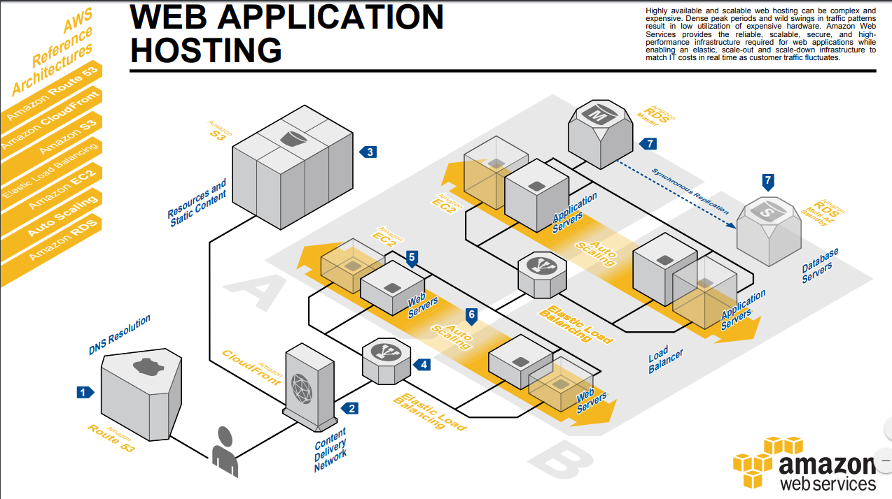

# Reto DevOps Hispano <!-- omit in toc -->

## Tabla de Contenidos <!-- omit in toc -->

- [Objetivo](#objetivo)
- [Pre-requisitos](#pre-requisitos)
- [Infraestructura](#infraestructura)
- [Gestión de la configuración](#gestión-de-la-configuración)
- [CI / CD](#ci--cd)
- [Contenedores](#contenedores)
- [Notas](#notas)

---------------------------------------------------------------------

## Objetivo

El objetivo de este reto no es otro que conocer, entender y practicar los principios de la filosofía DevOps a través de una serie de ejercicios.

Cada ejercicio de este reto es libre de ser realizado con las herramientas que se desee siempre y cuando se cumpla con los mantras del mismo:

- No crear o configurar recursos en una interfaz web a menos que sea la **única** vía posible.
- No tocar archivos de configuración del sistema o la aplicación de forma manual.
- No acceder por SSH a tus servidores más que para depurar algo extraño.

## Pre-requisitos

1. Tener una cuenta en AWS. Si es la primera vez que usa AWS puede aprovechar la [capa gratuita](https://aws.amazon.com/es/free/) durante un año.
2. Crear un par de claves de acceso (Programmatic access) que correspondan a un usuario con privilegios de Admin[¹] para poder crear recursos.
3. Un dominio gratuito o de pago que te permita cambiar los NS autoritarios a los de AWS (para su uso con Route53)

## Infraestructura

1. Escoge de las herramientas de aprovisionamiento de infraestructura del DevOps roadmap tu elegida, Terraform o Cloud Formation.
2. Crea un nuevo proyecto y define tres entornos: DEV, STAGING, PROD, cada entorno tendrá los mismos componentes de la arquitectura elegida. Cada entorno se engloba dentro de un VPC
3. Describe en infraestructura como código (IaC) lo necesario para crear desde cero y sin intervención manual la siguiente arquitectura propuesta: ([PDF](https://media.amazonwebservices.com/architecturecenter/AWS_ac_ra_web_01.pdf))

**La arquitectura consiste en (para cada VPC):**

1. Una zona en Route53 con los registros necesarios
2. CDN (opcional)
3. S3 para contendo estático y recursos (opcional)
4. Balanceador de carga  (ELB) público
5. Instancias de los servidores web
6. Grupo de Autoescalamiento (ASG) de las instancias de los servidores web
7. Bases de datos RDS (base de datos relacional) con máster y rpelica

En el diagrama no se indica con número, pero se observa otro ASG para los servidores de aplicaciones al igual que un ELB interno. Puede crear estos o no.

Caso 1: **NO**,  en este caso, los servidores web (5) alojaran la apliación web y desde ellos se conectará a la BBDD RDS.
Caso 2: **SI** en este caso, los servidores web actuarán como proxies reversos a los servidores de aplicaciones y estos últimos serán quienes se conecten a la BBDD.

Disfruta de lo que se siente crearla y destruirla cuantas veces quieras. 🙃

## Gestión de la configuración

Luego con la infra creada, escoge tu gestor de configuración favorito (Ansible, Puppet, Chef, Salt...) y configura todos los servidores y las BBDD.

Como lo harías a mano. Pero todo a golpe de gestor de configuración. O sea... no cambies un archivo de configuración a mano. Luego, reconfigurarlos muchas veces más.

Una vez configurada la base del sistema, despliega de la misma forma automágica la aplicación web, puedes usar una simple aplicación web que tenga sólo parte front (no te conectarías a las BBDD) o usar dos applicaciones, una de front y otra de backend que se conectaría a la BBDD.

Se proponen los siguientes ejemplos:

1. [Análisis de sentimiento](https://github.com/rinormaloku/k8s-mastery)  (Front + Back)
2. [RealWorld](https://github.com/gothinkster/realworld)  (Front + Back)
3. [Kotlin Full-stack Application Example](https://github.com/Kotlin/kotlin-fullstack-sample) (Front +  Back)
4. Lectura Extra: [crear un servidor web para conectarse a la instancia de base de datos de Amazon RDS](https://docs.aws.amazon.com/es_es/AmazonRDS/latest/UserGuide/CHAP_Tutorials.WebServerDB.CreateWebServer.html)

**Finaliza esta parte con el siguiente objetivo:**

Suponiendo que tu dominio es **dominio.tld**:

- prod.dominio.tld mostraría la app del entorno de PROD
- staging.dominio.tld mostraría la app del entorno de STAGING
- dev.dominio.tld mostraría la app del entorno de DEV

## CI / CD

Luego de eso diría que te pongas un pipeline en tu CI/CD favorito. Hazte una web app de prueba en un repo git. Y que tu pipeline compile si tiene que compilar, suba los artefactos al entorno de staging/pre, les haga +  pruebas y si las pasa que lo despliegue en el entorno de pro.

Estos entornos podrían ser diferentes instancias  o diferentes VPCs en tu cuenta de AWS.

Algo tan sencillo como un hello world, y probar que la llamada a la URL te devuelva eso. O un botón de X color. Lo que sea.

## Contenedores

Luego de eso, me metería en el tema de contenedores, tanto montar la infra para contenedores como que tu CI/CD genere la imagen docker, la suba a un registry y tu orquestador de contenedores la despliegue.

## Notas

[¹]: Para iniciación rápida a _IaC_ esta es una forma de no tener problemas de permisos pero es una **MUY MALA** práctica. Las cuentas con _Programmatic access_ deben de tener permisos bien pensados. Un par de credenciales filtradas pueden resultar en una cuenta comprometida, destrucción de recursos y facturas sorpresas.
